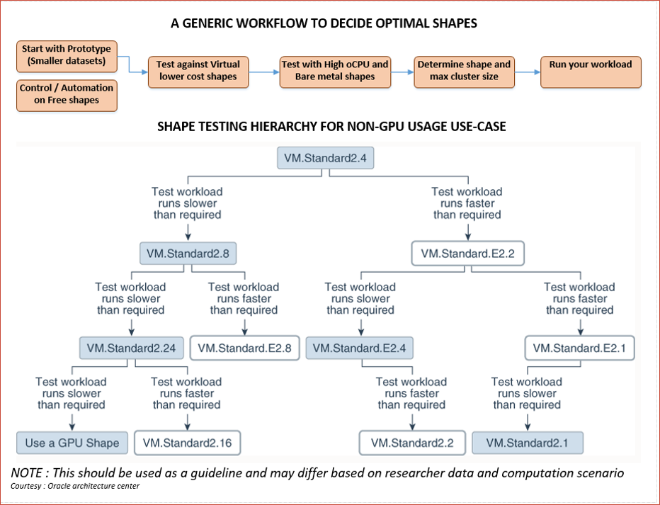
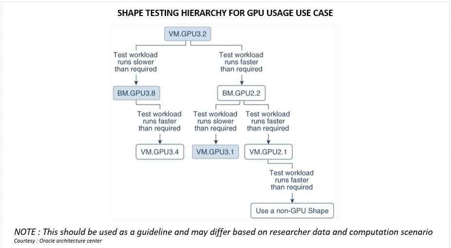

## Performance benchmarking with Oracle shapes

By Rajib Ghosh, Senior Solutions Architect, Oracle for Research

Choosing the right Oracle cloud hardware shape to run your workload could be a challenging task with a variety of shapes available. This page provides a basic guideline that can be used to arrive at the right set of shapes that can be used for your workload. A guideline for both CPU as well as GPU shapes are presented here.

### Principle
1. Start with a set of smaller datasets 
2. Data sets should represent your actual production workload.
3. Move to a higher CPU/GPU shape if you require better performance
4. Move to a lower end shape if you require better price performance
5. General principles - 
   * Shapes with larger CPU / RAM perform better.
   * AMD EPYC shapes perform better than Intel standard shapes
   * DenseIO shapes perform better for large data and IO intensive applications
   * HPC shapes performed better on high inter-memory communications on parallel processes
   * GPU shapes perform better when large matrix manipulations and tensor core hardware is required

### Shape testing for CPU usage
The diagram below shows the generic workflow that can be adopted to decide on optimal CPU shapes. The key steps of the process are:
1. Start with a prototype (smaller datasets)
2. Start with a most common standard virtual shape with lower CPU or RAM
3. Test with virtual machine shape
4. Test with higher CPU or Bare metal (BM) shapes
5. Determine shape and the max cluster size 
6. Create the cluster and run your workload 

#### Notes 
1. Left branch of the graph depicts your performance requirement
2. Right branch of the graph depicts your cost (price-performance) requirement

### Shape testing for GPU usage
The diagram below shows a generic workflow that can be adopted to decide on optimal GPU shapes. The key steps of the process are:
1. Choose a virtual GPU shape.
2. VMGPU3.x shape is recommended start if you have relative higher GPU load
3. Choose V100 (GPU3.x and above) over P100 (BMGPU2.x) shapes
4. Choose to higher BMGPU3.x (V100) shape for higher performamce
5. Move down to a lower BMGPU2.x (P100) shape or a CPU shape for better price-performance
6. Determins shape and max cluster size
7. Create the cluster and run your workload 

#### Comment
This diagram should be used as a framework guideline for determining the right shape and standing up a cluster.

### References
1. [Oracle Architecture center](https://www.oracle.com/cloud/architecture-center.html)
