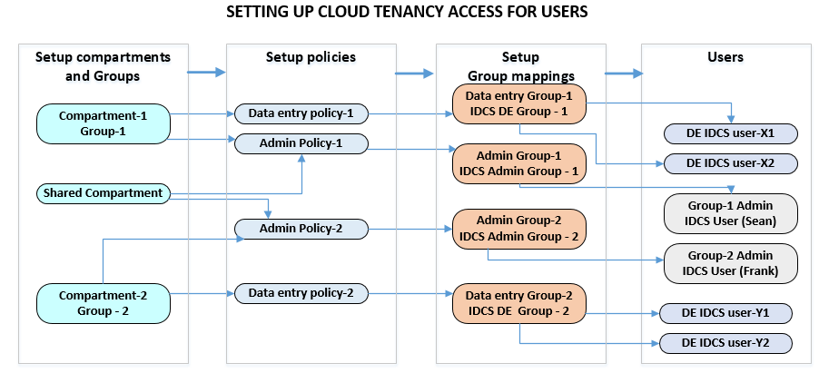

## Setting up Org structure in Oracle cloud

In this article, we discuss how to set up a simple organization structure with OCI Identity services with multiple administrators and multiple groups. Also included are the common methods of ongoing management of users and groups after the initial setup is complete.

### Organization setup

Shown below is a common Org setup that are applicable to most organizations. Key points are: 
* Two tenancy administrator having the same level of access
* Multiple groups - each able to create and manage objects they own

### Resource access components

Oracle cloud recommends accessing resources through the Identity services (IDCS) account (Single-sign-on SSO based) as opposed to native login
The key access components are described below. 
1. Compartments: A sub-folder in OCI tenancy that holds the objects (i,e instances, databases etc)
2. Groups: An Oracle tenancy group that is geared to perform actions based on the assigned policies
3. Policies: Set of privileges associated with a compartment (set of resources) and group (set of user / group) 
3. Identity service Group: Group of Identity service (IDCS) users 
4. Group Mappings: Mapping between IDCS groups and Oracle tenancy groups to inherit resource access through policies

### Org setup workflow 

The key recommendations for org structure management are:
1. Manage access to resources with policies
2. Assign policies to one or multiple groups requiring access to resources 

### Accessing shared resources 

1. **Sharing Block (BV) volumes or file system shares (FSS) volumes**
* Typically, you would create a shared compartment for the block volumes and file system shares and would add or edit individual policies (shown below) to give access to the groups of user who manage or access the shared resources 
2. **Sharing Object store buckets** 
* Saring of object store buckets and files can be performed in the following ways
  * Creating a pre-authenticated request on the object or the bucket and distributing directly to users
    * Minimal administrative overhead but changes to object require generation of another pre-authenticated URL
  * Buckets can be assigned to a shared compartment and can be made public or private for content visibility
3. **Sharing running instances and databases**
   * Sharing a running compute instance or a database is outside the scope of OCI console.
   * Any compute instance can be accessed through SSH as long as you have the private key and the public IP for the instance.
   * Any databases can be accessed if you have the database credentials available

### Adding and deleting users 

It is recommended to follow the guidelines below for a streamlined managed environment.
1. Never change the original tenancy admninistrator PI account.
2. If you need to add administrator, preferably add them as identity service user and assign the administrator group to them.
3. Groups and policies should be created and mapped to Identity services (IDCS) groups.
4. Users should be created as IDCS users and mapped only to IDCS groups
5. When deleting an user, the IDCS user only needs to be deleted.

The advantage of the above process is 
1. Better and quicker user manageability - takes only a few seconds.
2. All resource permissions are preserved at group level
3. No resources need to be destroyed because of user deletion
4. Access control is multi-layered i,e in policies, groups and users

