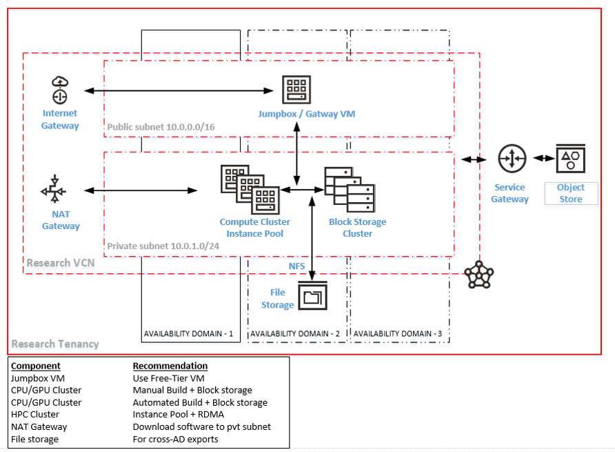

## Implementing OCI standard Architecture for Researchers

This page describes the standard oracle cloud architecture for researchers. 

### Architecture 

#### Features 
1. Create a compartment
2. Create a VCN through the VCN deployment wizard
3. This creates a public and a private subnet with associated network interfaces (i,e Internet gateway and NAT Gateway)
4. Create a free tier compute instance on public subnet
5. Create your compute instances in the private subnet
6. Create a compute cluster manually or through instance scaling
7. Create block storages and attach them to instances
8. Create shared block storages and attach them to instances
9. Create FSS share and you may split compute instances across Aavailability domains if required

#### Recommandations
1. Jumpbox / Research Gateway VM - Use Free Tier shape
2. CPU/GPU Cluster - can do a manual + Block storage build
3. CPU/GPU Cluster - better to create an instance pool with instance configuration
4. HPC Cluster - Plan on number of nodes first and deploy a cluster network (RDMA)
5. Startup / Terminate from the instance cluster as opposed to individual VMs
6. Use File storage for cross-AD data exports

### Advantages
Key advantages include

#### Being a standard
1. Quick and easy to implement 
2. Easier resource management
3. Single & common reference for all researchers
#### Automation
1. One-click standup and shutdown of instance through console (Stacks and Terraform) 
2. Quick and easy configuration management
3. Programmatic automation (CLI / API) through a Free-tier VM
#### Better resource utilization
1. Planned utilization of CPU/GPU/Storage resources
2. Effective cluster and computational planning
3. Better credit usage and service limit allocation
#### Better benchmarking
1. Benchmarking against similar hardware & computational specifications
2. Leverage performance tips from Oracle
3. Testing same workload against higher end shapes
#### Quicker support 
1.  Issues can ne resolved faster
2. Issues can be replicated/tested without access to researcher tenancies
3. Comparative benchmarks from the community can help tune your implementation 
#### Security
1. Private subnet insulates your computation VM and data
2. Access only through a jump box / secure gateway VM
3. NAT access provides direct internet access for code / patch downloads
